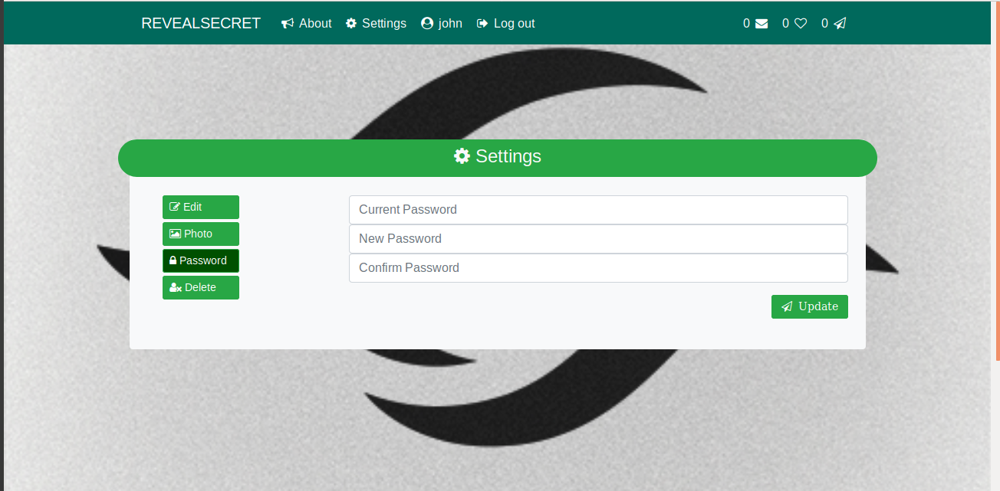

# revealsecret
### concept from sarahah


# Installation

### Create virtual environment & goto the dir

Linux
```bash
virtualenv -p /usr/bin/python3 revealsecret
cd revealsecret/
```

Windows
```bash
virtualenv revealsecret
cd .\revealsecret\
```

### Activate virtualenv

Linux
```bash
source bin/activate
```

Windows
```bash
.\Scripts\activate
```

**clone the project**
```bash
git clone https://github.com/rk4bir/revealsecret.git
```

### Install reequirements.txt
```bash
python -m pip install -r requirements.txt
```

### goto src directory and create db models.
```bash
cd src/
python manage.py migrate
```

### Run dev server at port 8888.
```bash
python manage.py runserver 8888
```
* now goto http://127.0.0.1:8888/
---


# SCREENSHOTS

## Inbox

---

## Send Message

---

## Registration

---

## Settings

---
